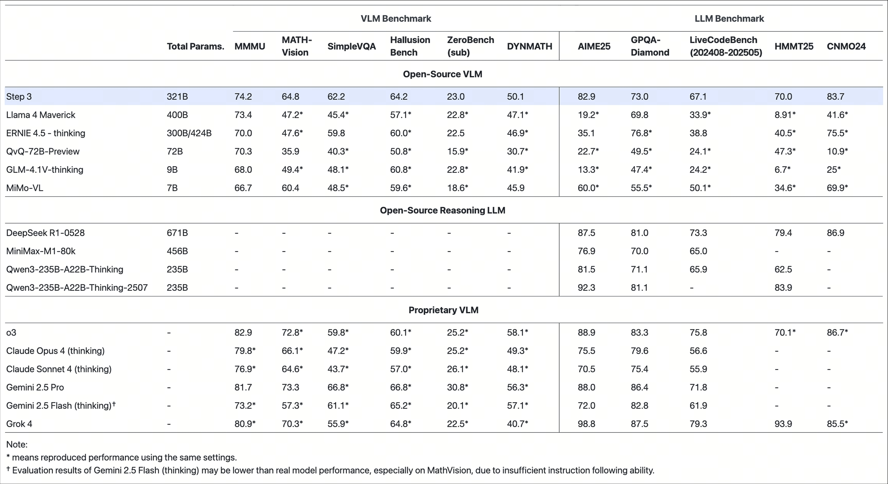

<div align="center">
  <picture>
      
  </picture>
</div>

<hr>

<div align="center" style="line-height:1">
  <a href="https://stepfun.com/" target="_blank"></a>
  <a href="https://stepfun.com/" target="_blank"></a>
</div>

<div align="center" style="line-height: 1;">
  <a href="https://huggingface.co/collections/stepfun-ai/step3-688a3d652dbb45d868f9d42d" target="_blank"></a>
  <a href="https://www.modelscope.cn/models/stepfun-ai/step3" target="_blank"></a>
  <a href="https://x.com/StepFun_ai" target="_blank"></a>
</div>

<div align="center" style="line-height: 1;">
<a href="https://discord.com/invite/E5AthJNz" target="_blank"></a>
  <a href="LICENSE"></a>
</div>

<div align="center">
<b>📰&nbsp;&nbsp;<a href="https://stepfun.ai/research/step3">Step3 Model Blog</a></b> &nbsp;&nbsp;&nbsp; | &nbsp;&nbsp;&nbsp; <b>📄&nbsp;&nbsp;<a href="https://arxiv.org/abs/2507.19427">Step3 System Tech Report</a></b>
</div>

## Introduction

Step3 is our cutting-edge multimodal reasoning model—built on a Mixture-of-Experts architecture with 321B total parameters and 38B active. 
It is designed end-to-end to minimize decoding costs while delivering top-tier performance in vision–language reasoning. 
Through the co-design of Multi-Matrix Factorization Attention (MFA) and Attention-FFN Disaggregation (AFD), 
Step3 maintains exceptional efficiency across both flagship and low-end accelerators.

### Step3 model card:

|          Config        |  Value  |
|------------------------|---------|
| **Number of Layers (Dense layer included)**|61|
|**Number of Dense Layers**| 5|
| **Hidden Dimension**       | 7168    |
| **Attention Mechanism**    | MFA     |
| **Low-rank Query Dimension** | 2048  |
| **Number of Query Heads**          | 64      |
| **Head Dimension**        | 256     |
|**Number of Experts** |48|
|**Selected Experts per Token**|3|
|**Number of Shared Experts**| 1|
| **Max Context Length** | 65536 |
| **Tokenizer** | Deepseek V3 |
| **Total Parameters (LLM)** | 316B |
| **Activated Params per Token** | 38B |
| **Total Parameters (VLM)** | 321B |


## Evaluation Results


## Deployment


> You can access Step3's API on https://platform.stepfun.com/ , we provide OpenAI/Anthropic-compatible API for you.
>

Our model checkpoints are stored in bf16 and block-fp8 format, you can find it on [Huggingface](https://huggingface.co/collections/stepfun-ai/step3-688a3d652dbb45d868f9d42d).

Currently, it is recommended to run Step3 on the following inference engines:

* vLLM
* SGLang

Deployment and Request examples for vLLM and SGLang can be found in the [Model Deployment Guide](docs/deploy_guidance.md).

## Contact Us
If you have any questions, please reach out at [contact@stepfun.com](mailto:contact@stepfun.com) .

## License
Both the code repository and the model weights are released under the [Apache License (Version 2.0)](./LICENSE).

## Citation
```
@misc{step3system,
      title={Step-3 is Large yet Affordable: Model-system Co-design for Cost-effective Decoding}, 
      author={StepFun Team},
      year={2025},
      eprint={2507.19427},
      archivePrefix={arXiv},
      primaryClass={cs.LG},
      url={https://arxiv.org/abs/2507.19427}, 
}

@misc{step3blog,
      title={Step3: Cost-Effective Multimodal Intelligence}, 
      author={StepFun Team},
      url={https://stepfun.ai/research/step3}, 
}
```
